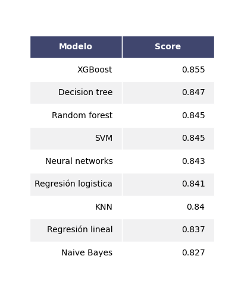
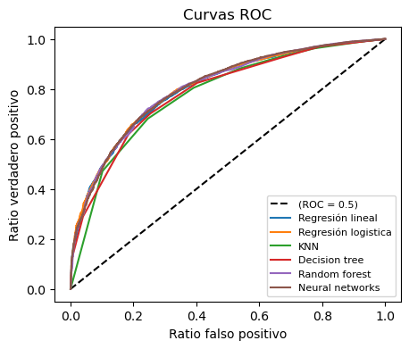

# Estimación de modelos de clasificación con la ENAHO del 2019
Mediante seis algoritmos diferentes, se buscó clasificar a las personas en situación en pobreza. Se usó los siguientes modelos:
1. Modelo de Regresión lineal
2. Modelo de Regresión logística
3. K-NN
4. Decision Trees
5. Random Forest
6. Redes neuronales
7. SVM
8. XGBoost
9. Naive Bayes

## Procesamiento de los datos
1. El primer paso fue la extracción de los datos. Mediante una función se extrajo el módulo requerido en los [microdatos](https://iinei.inei.gob.pe/microdatos/) de INEI.
2. Segundo, se transformó, creó y exploró las variables de interés de tal manera que puedan ser estimadas en sus respectivos algoritmos.
3. Finalmente, se dividió la base de datos en 2 sets diferentes: entrenamiento y testing. Con el primer set de valores se realizó el entrenamiento de los modelos para conseguir los parámetros asociados a cada explicativa. Con el segundo set se estimó el ajuste que tiene cada modelo con respecto a nuevos insumos. 

## Resultados
Las principales conclusiones son las siguientes:
1. **Relaciones esperadas**:
* La edad, contar con estudios superiores, haber estudiado en colegio privado, vivir en zona urbana y contar con mayores ingresos reducen las probabilidades reducen las probabilidad de encontrarse en situación de pobreza.
* El ser hombre vuelve más probable encontrarse en situación de pobreza.

2. **En términos de ajuste**:
* El modelo de Decisión Tree, regresión logística y redes neuronales son los de mayor ajuste.
* El modelo lineal, pese a no ser un algoritmo de clasificación, parece tener un buen ajuste.
* En general, las diferente de `score` son muy pequeños entre todos los algoritmos.

3. **Métricas de asimetría**:

4. **Con respecto al trade-off en la clasificación, medido por el ROC:**
* Todos los modelos parecen tener un ROC muy similar, lo cual podría sugerir que los modelos encuentran un ratio de aciertos muy parecido. Esto validaría los resultados encontrados en el punto (2).

  

  

