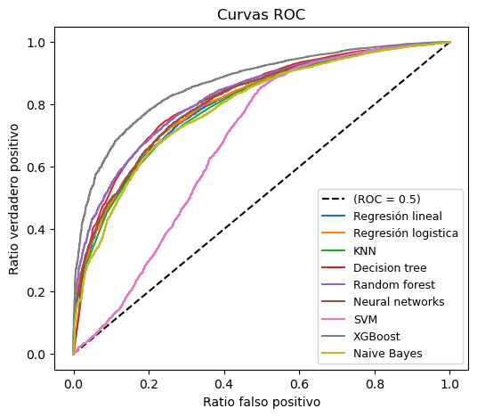

# Estimación de modelos de clasificación con la ENAHO del 2019
Mediante nueve algoritmos diferentes, se buscó clasificar a las personas que se encuentran o no en situación en pobreza. Se estimó un modelo por cada algoritmo:
1. Modelo de Regresión lineal
2. Modelo de Regresión logística
3. K-NN
4. Decision Trees
5. Random Forest
6. Redes neuronales
7. SVM
8. XGBoost
9. Naive Bayes

## Pasos tomados
1. Se extrajo los módulos requeridos en los [microdatos](https://iinei.inei.gob.pe/microdatos/) de INEI.
2. Se transformó, creó y exploró las variables de interés de tal manera que puedan ser estimadas en sus respectivos algoritmos.
3. Finalmente, se dividió la base de datos en 2 sets diferentes: entrenamiento y testing. Con el primer set de valores se realizó el entrenamiento de los modelos para conseguir los coeficientes asociados a cada variable. Los hiperparámetros fueron conseguidos mediante GridSearchCV. Con el segundo set se midió el ajuste que tiene cada modelo con respecto a estos nuevos insumos.

## Resultados
Las principales conclusiones son las siguientes:

**Relaciones esperadas**:
* La edad, contar con estudios superiores, haber estudiado en colegio privado, vivir en zona urbana y contar con mayores ingresos reducen las probabilidades reducen las probabilidad de encontrarse en situación de pobreza.
* El ser hombre vuelve más probable encontrarse en situación de pobreza.

**En términos de ajuste**:
* En general, las diferente de `score` son muy pequeños entre todos los algoritmos.
* El modelo de XGBoost, Decisión Tree y Random forest son los de mayor ajuste.
* El modelo lineal, pese a no ser un algoritmo de clasificación, parece tener un buen ajuste. Posiblemente sea por lo desbalanceado que se encuentra la base de datos.

**Métricas de asimetría**:
* La métrica de _precision_, asociada a la cantidad de 1 que se aciertan dado el total de estimaciones que asignan 1, muestra que el Naive Bayes, XGBoost y Decision tree son los algoritmos que menos erran al asignar 1.
* La métrica de _recall_, asociada a la cantidad de 1 que se aciertan dado los verdaderos 1, muestran que la regresión final, acierta casi con 100% de efectividad. Los siguen los demás con 90% de aciertos todos. Este resultado que muchos de los modelos sobre estima los valores de 1, debido al desbalance que hay en la base de datos.
* La métrica de _F1-Score_, el cual combina ambas métricas, dan resultados consistentes a los encontrados al de ajuste.

**Con respecto al trade-off en la clasificación, medido por el ROC:**
* Todos los modelos parecen tener un ROC muy similar, lo cual podría sugerir que los modelos encuentran un ratio de aciertos muy parecido. Esto validaría los resultados encontrados en el punto (2).

  

  

